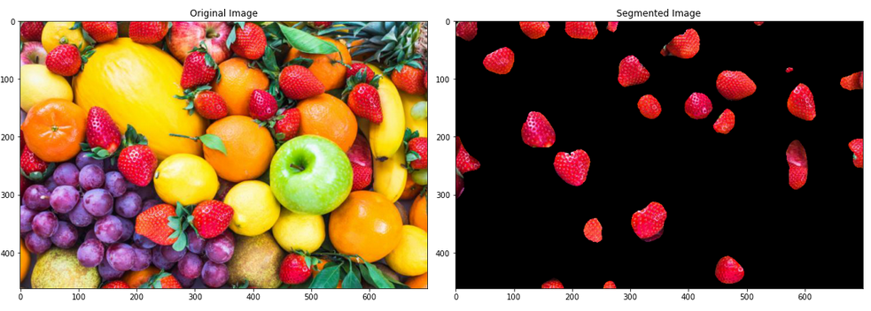

# Color Segementation Filtering and Masks

  

---------------------------------------------

## About this Project:

The project focuses on color segementation in images using OpenCV, a powerful image porocessing library. The core of the project is the `ColorSpaceProcessor` class, designed to extract specific solors from an image by converting it into various color spaces like grascale and HSV(Hue, Saturation, Value). The class allows users to specify color ranges for segementation and efficientyl processes images to isolate these colors. This functionality is particularly valuable in applications hwere precise color detection and isolation are crucial, such as in quality control, medical imaging, or even in artistic domains. The script is a testament to the versatility of Python and OpenCV in handling complex image processing tasks with ease and efficiency.

---------------------------------------------

## What is Color Segementation vs Image Segementation:

### Color Segmentation
Color segmentation is a process in image processing that involves dividing an image into segments based on color. By analyzing the color distribution and separating pixels into groups with similar colors, this technique simplifies image analysis, particularly useful in applications like object tracking, quality control, and sorting systems. It typically employs color spaces such as HSV or LAB for more effective segmentation and relies on methods like color thresholding, but it can be challenged by varying lighting conditions which affect color consistency.

  

### Image Segmentation
Image segmentation is a crucial technique in image processing where an image is partitioned into multiple segments or regions to simplify and change its representation, making it more meaningful for analysis. Unlike color segmentation, it considers various image attributes like texture, intensity, and color, using methods such as thresholding, clustering, and deep learning. Image segmentation is essential in diverse applications, from medical imaging for tissue differentiation to autonomous driving for scene understanding, offering a comprehensive approach to understanding and interpreting complex image data.

  

---------------------------------------------

## Project Observations:

### Original Image ➔ Gray Image ➔ HSV Image ➔ Threshold/Mask Image ➔ ColorSpaces & Filtering

#### Blue Color

  
  
  
  
  

---------------------------------------------

#### Green Color

  
  
  
  
  

---------------------------------------------

#### Red Color

  
  
  
  
  

---------------------------------------------

#### Yellow Color

  
  
  
  
  

---------------------------------------------

## Result and Analysis:

---------------------------------------------

## My Project Video Demonstration:

  
  

---------------------------------------------
